<div align="center">

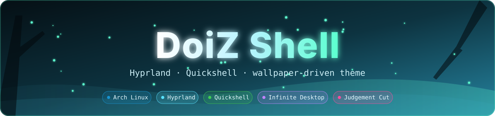

<a href="https://github.com/Ziod2812/DoiZ-Shell"></a>

<br>


<br>

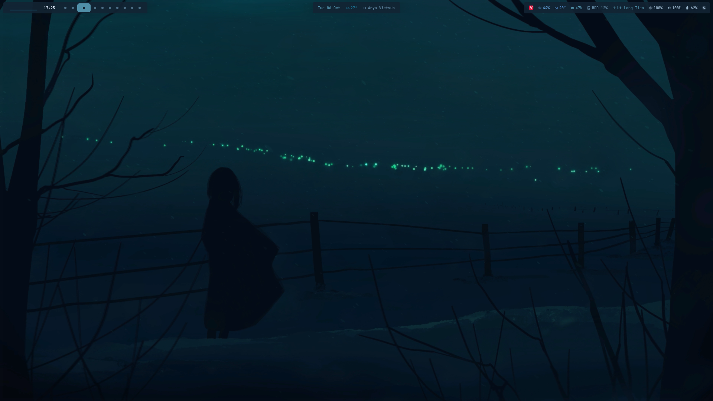

<sub>Every color you see comes from the wallpaper.</sub>

<br><br>

[**✨ Features**](#-features) &nbsp;•&nbsp; [**📸 Gallery**](#-gallery) &nbsp;•&nbsp; [**🎨 Theme engine**](#-theme-engine) &nbsp;•&nbsp; [**📦 Install**](#-install) &nbsp;•&nbsp; [**⌨️ Keybinds**](#️-keybinds) &nbsp;•&nbsp; [**📁 Layout**](#-directory-layout) &nbsp;•&nbsp; [**🧰 Guides**](#-guides)

</div>

---

## ✨ Features

<table>
<tr>
<td width="50%" valign="top">

### 🎨 Dynamic theme
Colors are extracted from the current wallpaper, **image or video**, and applied live to Waybar, every Quickshell panel, btop, cava, kitty, GTK / Thunar and the icon theme.

### 🧩 Quickshell shell
Control Center, launcher, settings, clipboard history, network, volume, brightness, battery, media popup and keybind help, all in one consistent style (4 px radius, JetBrainsMono Nerd Font).

### 📊 Waybar
Workspaces, clock, weather, now playing with cava visualizer, CPU / temperature / RAM / disk, network, volume, brightness and battery.

</td>
<td width="50%" valign="top">

### 🖼️ Wallpapers
Images and videos (mpvpaper) with awww transitions, ffmpeg thumbnails, a color filter, a large live preview and automatic restore at login.

### ♾️ Infinite Desktop v2
A pan and zoom canvas where every window floats. Auto Arrange Grid when you want order back.

### ⚔️ Close effects
**Judgement Cut** (Vergil), Portal, Ice, Glass Break and Black Hole, with a live picker and a test mode.

### 🌗 Dark Mode button
Switches GTK, Qt, Firefox, Chromium, Electron and icons while the shell keeps following the wallpaper.

</td>
</tr>
</table>

---

## 📸 Gallery

<table>
<tr>
<td width="50%" align="center">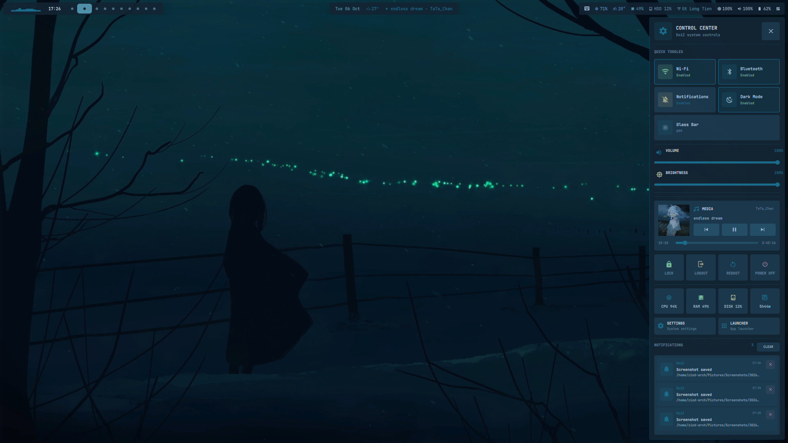<br><b>🎛️ Control Center</b><br><sub><code>Super + N</code> — toggles, volume, brightness, media, power, notifications</sub></td>
<td width="50%" align="center">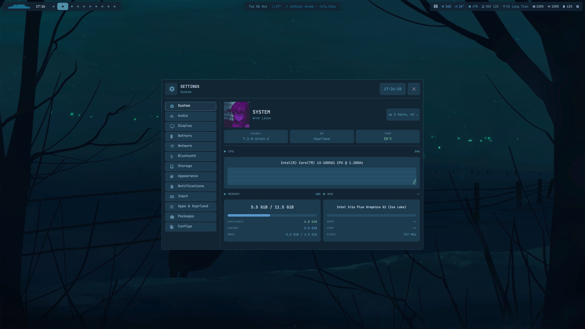<br><b>⚙️ Settings</b><br><sub><code>Super + I</code> — System, Audio, Display, Battery, Network, Bluetooth, Storage, Appearance…</sub></td>
</tr>
<tr>
<td width="50%" align="center">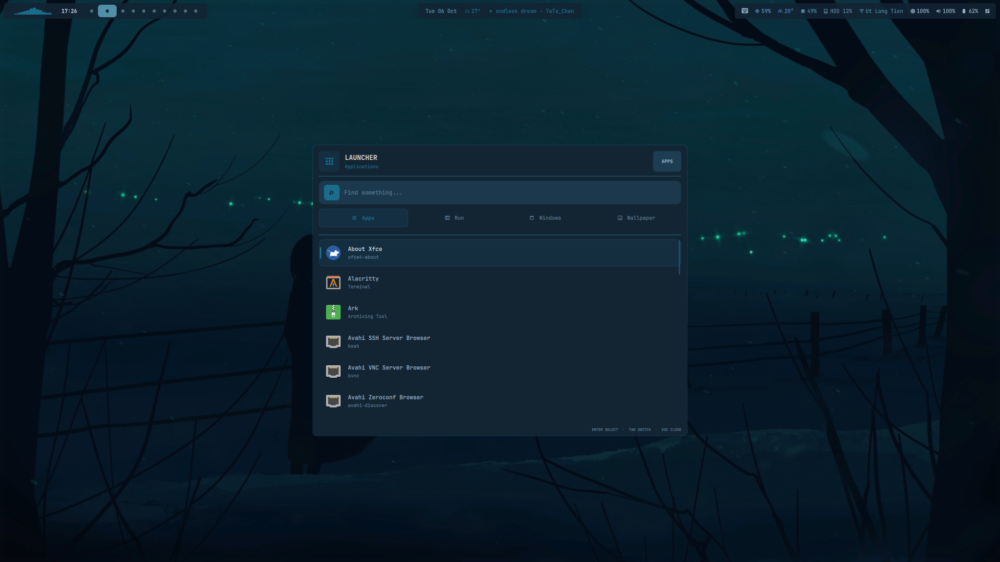<br><b>🚀 Launcher</b><br><sub><code>Super</code> — Apps, Run, Windows, Wallpaper (<code>Tab</code> to switch)</sub></td>
<td width="50%" align="center">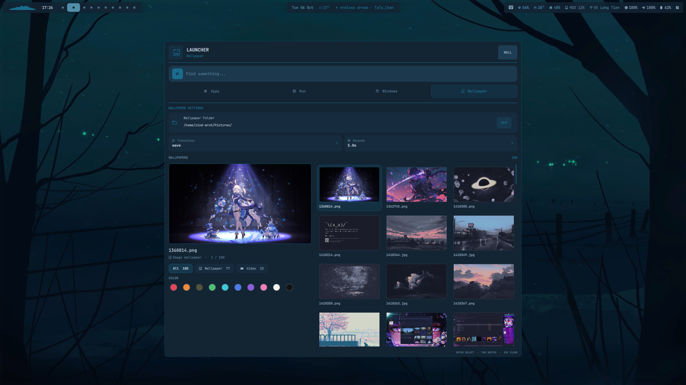<br><b>🖼️ Wallpaper picker</b><br><sub>Images + videos, transitions, colour filter, big preview</sub></td>
</tr>
<tr>
<td width="50%" align="center">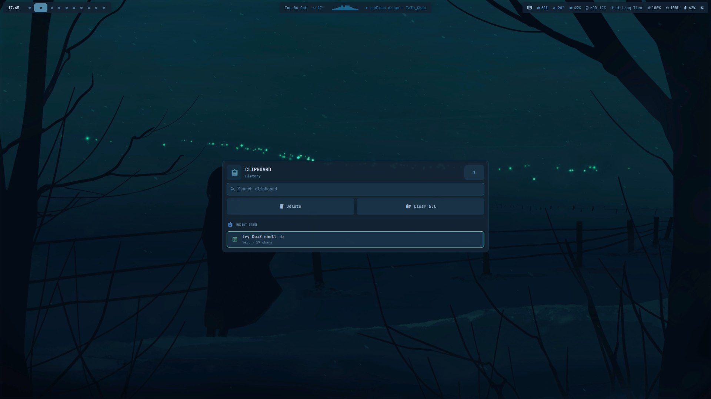<br><b>📋 Clipboard history</b><br><sub><code>Super + V</code> — text and images, search, preview</sub></td>
<td width="50%" align="center">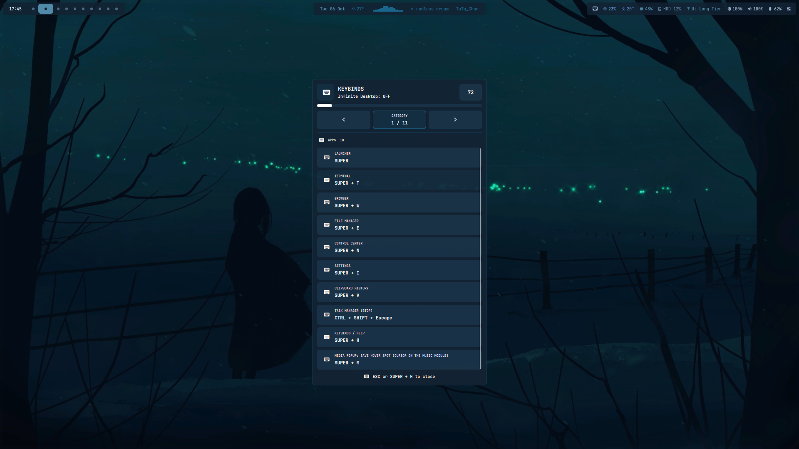<br><b>⌨️ Keybind help</b><br><sub><code>Super + H</code> — every bind, by category</sub></td>
</tr>
<tr>
<td width="50%" align="center">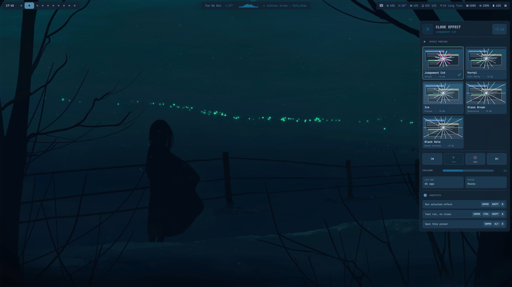<br><b>⚔️ Close effect picker</b><br><sub><code>Super + Alt + B</code> — live preview, TEST / RUN, cooldown</sub></td>
<td width="50%" align="center">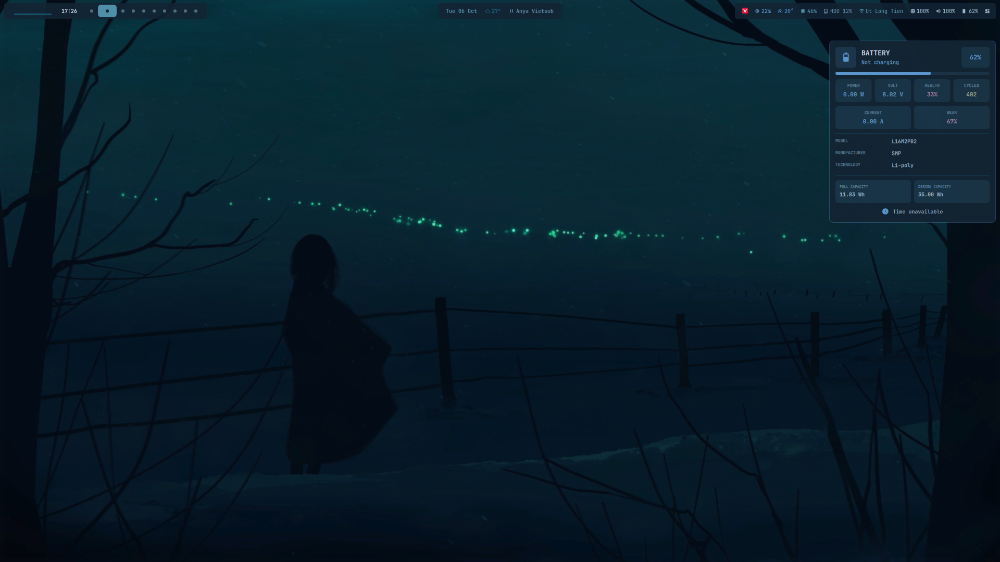<br><b>🔋 Battery popup</b><br><sub>Power, voltage, health, cycles, capacity</sub></td>
</tr>
<tr>
<td width="50%" align="center">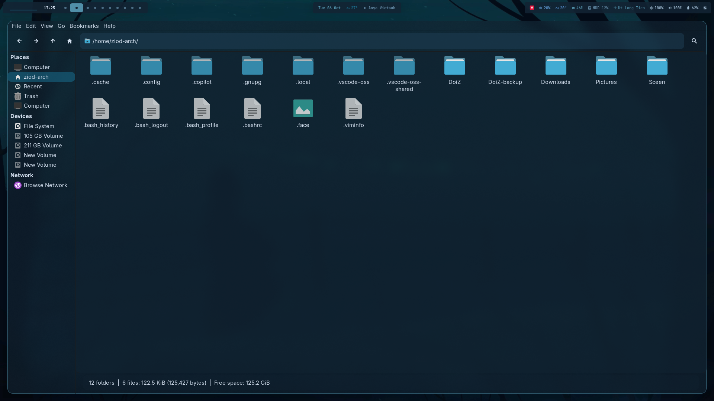<br><b>📁 Thunar</b><br><sub>Translucent, rounded, wallpaper-coloured Papirus icons</sub></td>
<td width="50%" align="center">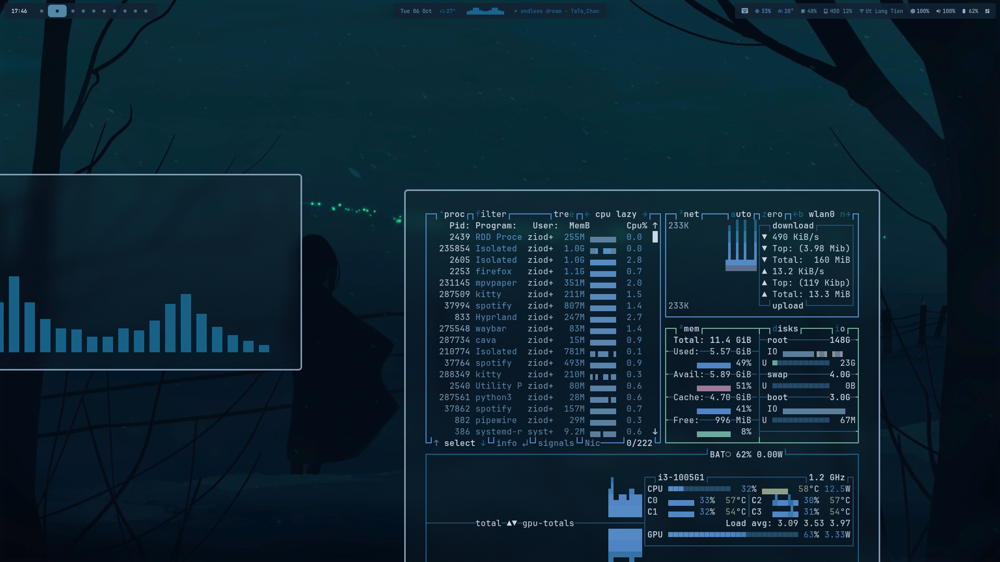<br><b>♾️ Infinite Desktop</b><br><sub>Floating windows on a pannable, zoomable canvas</sub></td>
</tr>
<tr>
<td width="50%" align="center">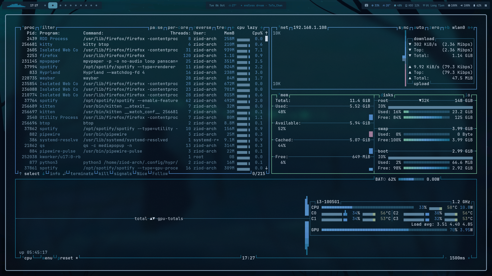<br><b>📈 btop</b><br><sub><code>Ctrl + Shift + Escape</code> — recoloured live by the theme engine</sub></td>
<td width="50%" align="center">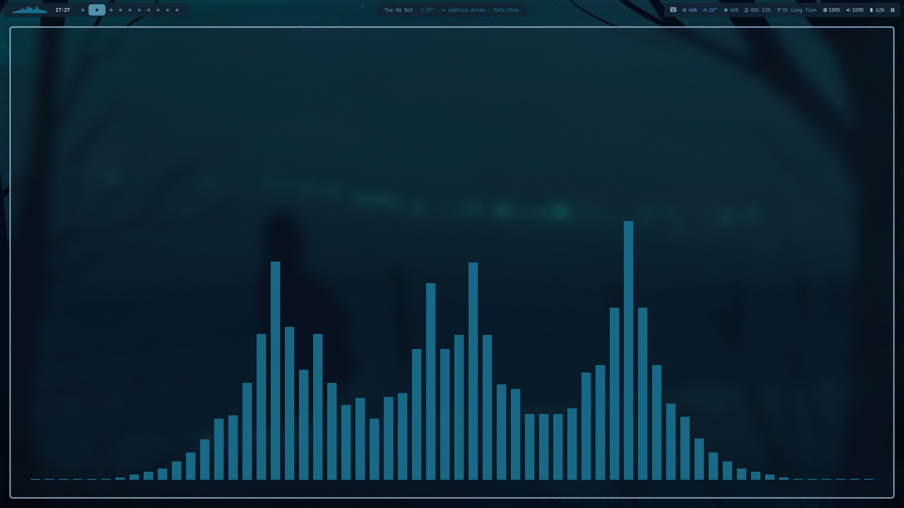<br><b>🎶 cava</b><br><sub>One colour from the wallpaper, transparent background</sub></td>
</tr>
</table>

---

## 🎨 Theme engine

Change the wallpaper and the whole desktop follows.

<div align="center">
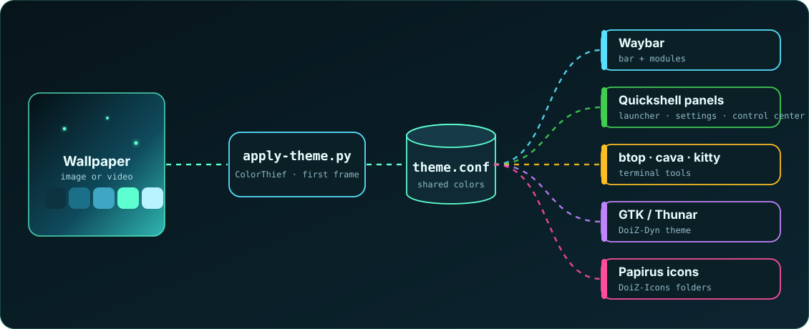
</div>

- Videos: the first frame of the new video is extracted and used for the colors.
- GTK3 apps restyle instantly: the engine alternates two wrapper themes (`DoiZ-Dyn-A` / `DoiZ-Dyn-B`).
- btop and cava are recoloured by sending `SIGUSR2` to the running instances.

---

## 📦 Install

> **Requirements:** Arch Linux, Hyprland **0.55 or newer** (Lua config), a Wayland session.

```bash
git clone https://github.com/Ziod2812/DoiZ-Shell.git
cd DoiZ-Shell
chmod +x install.sh
./install.sh
```

What the installer does:

1. Installs packages from `packages/arch.txt` and `packages/aur.txt` (yay is bootstrapped when missing).
2. Moves your old config to `~/DoiZ-backup/date-<Y-m-d>_time-<H-M-S>` instead of mixing it in.
3. Copies every folder of `dotfiles/` into `~/.config`, merges `xdg-desktop-portal`, sets a default Qt palette and dark mode on a fresh install.
4. Runs a final check (`jq`, `socat`, `timeout`, `pgrep`, script syntax, Waybar cava module).

Then **log out and back in** (or start Hyprland) so the session picks up the environment.

> [!TIP]
> Press **`Super + H`** at any time to see every keybind. Run games in *Borderless Windowed*, not exclusive Fullscreen.

### 🧱 Stack

| Part | Tool |
|---|---|
| Compositor | Hyprland (Lua config) |
| Shell | Quickshell (QML) |
| Bar | Waybar + cava (`waybar-cava`) |
| Wallpaper | awww, mpvpaper |
| Terminal | kitty |
| File manager | Thunar + Papirus icons |
| Clipboard | cliphist + wl-clipboard |
| Recording | wf-recorder |
| Lock / idle | hyprlock, hypridle |
| Theme engine | `apply-theme.py` (ColorThief) |

---

## ⌨️ Keybinds

Every bind below is defined in `dotfiles/hypr/config/keybinds.lua` and listed in the help popup (`Super + H`).

### 🚀 Apps
| Key | Action |
|---|---|
| `Super` (release) | Launcher |
| `Super + T` | Terminal |
| `Super + W` | Browser |
| `Super + E` | File manager |
| `Super + N` | Toggle Control Center / sidebar (Quickshell) |
| `Super + I` | Settings (System, Audio, Display, Appearance, Notifications, Input, Apps & Hyprland, Packages...) |
| `Super + V` | Clipboard history |
| `Ctrl + Shift + Escape` | Task manager (btop in the terminal) |
| `Super + H` | Keybinds help |
| `Super + M` | Media popup: save the hover spot (put the cursor on the music module in Waybar first) |

### 🪟 Windows
| Key | Action |
|---|---|
| `Super + Q` | Close |
| `Super + F` | Fullscreen |
| `Super + Alt + F` | Maximize |
| `Super + Alt + Space` | Toggle floating |
| `Ctrl + Super + \` | Center window |
| `Super + P` | Pin (visible on every workspace) |
| `Super + X` (hold, with mouse) | Resize window |

### 🗂️ Workspaces
| Key | Action |
|---|---|
| `Super + 1..0` | Go to workspace 1..10 |
| `Super + Alt + 1..0` | Move window to workspace 1..10 |
| `Ctrl + Super + 1..0` | Go to workspace group (10..100, step 10) |
| `Ctrl + Super + Alt + 1..0` | Move window to workspace group |
| `Super + scroll` | Previous / next workspace |
| `Super + S` | Toggle special workspace (scratchpad) |
| `Super + Alt + S` | Send window to the special workspace |
| `Ctrl + Super + Shift + ↓` | Bring window back from the special workspace |

### ♾️ Infinite Desktop v2

| Key | Action |
|---|---|
| `Super + Shift + D` | Infinite Desktop ON / OFF |
| `Super + D` | Toggle floating / tiled for all windows on the workspace |
| `Super + Shift + A` | Auto Arrange Grid ON / OFF |
| `Super + ←/→/↑/↓` | Focus / navigate windows |
| `Super + Shift + ←/→/↑/↓` | Move floating window |
| `Super + Alt + ←/→/↑/↓` | Move tiled window |
| `Super + Ctrl + Alt + ←/→/↑/↓` | Resize window |
| `Super + Shift + hold left mouse button` | Pan the whole desktop (drag the canvas, not the app) |
| `Super + Alt + scroll` | Zoom the canvas in / out around the cursor |
| `Super + Alt + A` | Reset the canvas zoom to the default size |
| `Super + Shift + B` | Judgement Cut: Vergil-style space slashes cut the screen into shards that fly apart and swallow every window on it (closing them). Other looks (`portal`, `ice`, `glass`, `blackhole`) via `effect =` in `~/.config/mycfg/blackhole.conf` |
| `Super + Ctrl + Shift + B` | Same effect, test mode (windows are put back, nothing is closed) |
| `Super + Alt + B` | Close-effect picker (same style as volume / brightness / battery): live preview of Judgement, Portal, Ice, Glass and Black Hole, click or mouse wheel to select, prev / TEST / RUN / next buttons, gold-odds and cooldown sliders, last-run info. Colors follow the theme live and change with the selected effect |
| `Super + hold left mouse button` | Drag the app under the cursor |

The Infinite Desktop scripts are bundled in `dotfiles/hypr/scripts/infinite-desktop/` (source: sarodscommits/hyprland-infinitie-desktop-v2, MIT). `install.sh` only downloads them from GitHub when a file is missing.

While Infinite Desktop is ON, `auto_float.py` floats every new window and every tiled window that is already open, so every app takes part in the canvas. It does nothing while Infinite Desktop is OFF.

`Super + H` always shows the **INFINITE DESKTOP** section, even when the daemon is OFF; the ON/OFF state is only shown in the title.

### 📋 Clipboard
| Key | Action |
|---|---|
| `Super + V` | Open the Quickshell clipboard |
| `Super + Alt + V` | Wipe the clipboard history |

The clipboard uses `cliphist` + `wl-clipboard`, supports text and images, search and image preview.

### 📸 Capture and record
| Key | Action |
|---|---|
| `Print` | Screenshot (full screen) |
| `Super + Shift + S` | Area screenshot |
| `Ctrl + Alt + R` | Start / stop screen recording (no audio) |
| `Super + Alt + R` | Start screen recording with audio |
| `Super + Shift + Alt + R` | Start screen recording of a region |

### ⚙️ System
| Key | Action |
|---|---|
| `Super + L` | Lock screen |
| `Super + Shift + R` | Reload Hyprland |

### 🎵 Media keys
| Key | Action |
|---|---|
| Volume up / down | Change volume by 5% (capped at 100%) |
| Mute / Mic mute | Toggle speakers / microphone |
| Brightness up / down | Change screen brightness by 5% |
| Play / Pause / Next / Previous | Control the active media player |

### ⌨️ Inside apps and popups

| Where | Key | Action |
|---|---|---|
| Launcher | `Tab` | Next mode (Apps / Run / Windows / Wallpaper) |
| Launcher | `↑` / `↓` | Move selection (whole rows in the Wallpaper grid) |
| Launcher (Wallpaper) | `←` / `→` | Previous / next wallpaper |
| Launcher (Wallpaper) | selection | The left pane previews the highlighted image or video |
| Launcher | `Enter` | Run / open the selected item |
| Launcher | `Esc` | Close |
| Clipboard popup | `↑` / `↓`, `Ctrl + P` / `Ctrl + N` | Move selection |
| Clipboard popup | `Enter` | Copy the selected entry |
| Clipboard popup | `Delete` | Remove the selected entry |
| Clipboard popup | `Esc` | Close |
| Network popup | `Enter` / `Esc` | Connect with the typed password / cancel |
| Wallpaper settings | `Enter` | Save the folder |
| Help popup | `Esc` / `Super + H` | Close |
| Touchpad | 3-finger horizontal swipe | Switch workspace |

---

## 📁 Directory layout

<details>
<summary><b>Show the full tree</b></summary>

```
DoiZ-Shell/
├── README.md
├── install.sh
├── packages/                         # arch.txt, aur.txt
│
├── dotfiles/                         # copied into ~/.config by install.sh
│   ├── electron-flags.conf           # Native Wayland flags for Electron
│   ├── code-flags.conf               # VS Code
│   ├── discord-flags.conf            # Discord
│   ├── hypr/
│   │   ├── hyprland.lua              # real entrypoint (Hyprland reads this file)
│   │   ├── hyprlock.conf
│   │   ├── hypridle.conf
│   │   │
│   │   ├── config/                   # every file that uses the hl.* API (Hyprland 0.55+)
│   │   │   ├── init.lua              # M.* bundle, not required anywhere at the moment
│   │   │   ├── env.lua
│   │   │   ├── programs.lua
│   │   │   ├── autostart.lua         # session, Infinite Desktop core, auto_float
│   │   │   ├── monitors.lua
│   │   │   ├── workspaces.lua
│   │   │   ├── input.lua
│   │   │   ├── mouse.lua
│   │   │   ├── visuals.lua
│   │   │   ├── animations.lua
│   │   │   ├── decoration.lua
│   │   │   ├── layout.lua
│   │   │   ├── keybinds.lua
│   │   │   ├── windowrules.lua
│   │   │   ├── layerrules.lua
│   │   │   └── misc.lua
│   │   │
│   │   ├── local/
│   │   │   └── custom.lua            # personal overrides, do not commit real values
│   │   │
│   │   └── scripts/
│   │       ├── doiz-session          # starts pipewire, awww, cliphist, polkit, fcitx5, hypridle, waybar
│   │       ├── doiz-controlcenter    # single-instance launcher + IPC for the control center
│   │       ├── doiz-notifd           # starts notifd, takes the D-Bus notification name from dunst/mako/swaync
│   │       ├── screenshot.sh
│   │       ├── screenshot-area.sh
│   │       ├── record.sh             # wf-recorder: toggle / audio / region
│   │       ├── lock.sh
│   │       ├── lock-media.sh         # lock screen: title + artist of the playing track
│   │       ├── idle-inhibit.sh
│   │       ├── reload.sh
│   │       ├── wallpaper.sh          # awww
│   │       ├── wallpaper-random.sh
│   │       ├── restore-wallpaper.sh     # login: puts the last wallpaper (image or video) back
│   │       ├── dark-mode.sh          # Control Center Dark Mode button: system apps only (see Dark Mode)
│   │       ├── video-wallpaper.sh            # entrypoint: first start / switch video
│   │       ├── video-wallpaper-transition.sh # last frame + awww img covers the switch
│   │       ├── video-wallpaper-stop.sh
│   │       ├── video-thumbnails.sh           # ffmpeg thumbnails of video wallpapers for the launcher grid
│   │       ├── toggle-infinite-desktop
│   │       ├── toggle-auto-arrange-grid
│   │       └── infinite-desktop/     # bundled Infinite Desktop v2 scripts + auto_float.py
│   │
│   ├── waybar/
│   │   ├── config.jsonc
│   │   ├── style.css                 # overwritten by apply-theme.py from theme.conf
│   │   ├── style.css.template
│   │   └── scripts/
│   │       ├── apply-theme.py        # ColorThief: image/video -> theme.conf -> waybar + btop + cava
│   │       └── weather.sh
│   │
│   ├── theme/
│   │   └── theme.conf                # shared color source, every UI reads it
│   │
│   ├── quickshell/
│   │   ├── notifd/shell.qml          # always running, owns the notification server (D-Bus), shows nothing on screen
│   │   ├── controlcenter/shell.qml   # popup (Super + N): lists the notifications held by notifd, closes itself
│   │   ├── launcher/                 # app / run / window / wallpaper picker
│   │   │   ├── services/WallpaperService.qml  # scans images + videos, calls awww / video-wallpaper.sh
│   │   │   ├── components/WallpaperItem.qml
│   │   │   └── components/WallpaperPreview.qml  # large preview of the highlighted wallpaper
│   │   ├── clipboard/shell.qml
│   │   ├── network/shell.qml
│   │   ├── volume/shell.qml
│   │   ├── brightness/shell.qml
│   │   ├── battery/shell.qml
│   │   └── keybinds/shell.qml        # keybind help, opened with Super + H
│   │
│   ├── cava/                         # config (ncurses), config_waybar (raw -> waybar),
│   │                                 # config_terminal (the `cava` command in a terminal:
│   │                                 # one color from the wallpaper, transparent background)
│   ├── btop/, kitty/, wlogout/, fish/   # fish: `cava` function points at config_terminal
│   ├── mycfg/                        # custom-keys.lua, theme-state.env: empty, unused
│   └── arkrc, QtProject.conf, xdg-desktop-portal/
```

</details>


---

## 🧰 Guides

<details>
<summary><b>🔲 Auto Arrange Grid</b></summary>

`Super + Shift + A` toggles a compact grid layout for app windows on the current workspace. Press it again to stop automatic rearrangement.

</details>

<details>
<summary><b>🌗 Dark Mode</b></summary>

The Dark Mode button in the Control Center runs `~/.config/hypr/scripts/dark-mode.sh toggle`.

| Component | How it changes |
|---|---|
| GTK3, GTK4, libadwaita, Thunar | `color-scheme`, the GTK theme pair (Adwaita / Adwaita-dark, adw-gtk3 / adw-gtk3-dark when present), `gtk-3.0` and `gtk-4.0` `settings.ini` |
| Firefox, Chromium, Electron, Flatpak | `xdg-desktop-portal-gtk` reads `color-scheme` (configured in `~/.config/xdg-desktop-portal/hyprland-portals.conf`) |
| Qt (qt6ct) | `apply-theme.py --system dark\|light` rewrites the qt6ct palette |
| Icons (Thunar, GTK, Qt) | `icon-theme` in gsettings, `gtk-icon-theme-name` in both `settings.ini` files and `icon_theme` in `qt6ct.conf`: Papirus-Dark in dark mode, Papirus-Light in light mode |
| Waybar, Quickshell, btop, cava, kitty | Unchanged, they keep following the wallpaper colors |

To change the wallpaper-driven parts too: `DOIZ_THEME_SCOPE=all ~/.config/hypr/scripts/dark-mode.sh toggle`.

Notes:

- Firefox must be set to the System theme (auto). Chromium must be in Device or GTK mode.
- Running Qt apps usually update by themselves; reopen the app if they do not.
- Log in again once after installing so `xdg-desktop-portal` picks up the right environment variables.

</details>

<details>
<summary><b>🔳 Window corners</b></summary>

Every window has 4 px rounded corners, the same radius as the Waybar modules (`rounding` in `~/.config/hypr/config/decoration.lua`). Thunar keeps 14 px through its own rule in `windowrules.lua`, because its GTK theme draws 14 px corners. Fullscreen windows stay square. Apply a change with `hyprctl reload`.

</details>

<details>
<summary><b>♻️ Wallpaper restore</b></summary>

The path of the last wallpaper is saved in `~/.local/state/doiz/current-wallpaper` by the launcher, `wallpaper.sh` and `video-wallpaper.sh`. `doiz-session` runs `restore-wallpaper.sh` at login, right after `awww-daemon` is up: an image is set with `awww img` and no transition, a video goes through `video-wallpaper.sh` and mpvpaper. If the file is missing or the path no longer exists (for example the wallpaper folder is on a drive that is not mounted yet), it falls back to `awww restore`. The theme colors are not recalculated, because `theme.conf` already holds the colors of that wallpaper.

</details>

<details>
<summary><b>🎬 Video wallpaper</b></summary>

- `video-wallpaper.sh`: switches to a video through `video-wallpaper-transition.sh` (an awww transition into the new video's first frame), then starts mpvpaper with `panscan=1.0` so the video fills the screen like awww does. The launcher passes the transition type and duration chosen in its wallpaper settings, so videos use the same effect as images. Outside the launcher, change the effect with `DOIZ_VIDEO_TRANSITION` (any awww transition type such as `grow`, `wave`, `fade`, `wipe`, `center`, `outer`, `random`) and its length with `DOIZ_VIDEO_TRANSITION_DURATION` (seconds, default 1).
- `video-thumbnails.sh`: prints `video<TAB>thumbnail` lines for every video in the wallpaper folder, generating missing thumbnails with `ffmpeg` (one frame at 1 s, or at 0 s for shorter videos) into `~/.cache/doiz/video-thumbs`. Thumbnails are keyed by path and modification time, so they are made once and refreshed when the file changes. The launcher shows them in the Wallpaper grid as they become ready and marks videos with a small play badge.
- `video-theme-frame.sh`: extracts the first frame of the new video for theme colors.
- `video-wallpaper-stop.sh`: stops mpvpaper and keeps the last frame on awww. It is called before an image wallpaper is set (Launcher and `wallpaper.sh`), because mpvpaper sits above awww and would otherwise cover the new image.

</details>

<details>
<summary><b>🧿 Icon theme</b></summary>

Thunar's folders, trash and sidebar icons come from Papirus (folders recolored to the wallpaper accent) (`papirus-icon-theme` in `packages/arch.txt`). `install.sh` runs `dark-mode.sh icons` to apply it, and the Dark Mode button switches between `Papirus-Dark` and `Papirus-Light`. If a theme is not installed, the current icons are left as they are.

- Other icon pack: `DOIZ_ICON_DARK=Name DOIZ_ICON_LIGHT=Name ~/.config/hypr/scripts/dark-mode.sh icons`, or edit the two variables at the top of `dark-mode.sh`.
- Folder color: follows the wallpaper. `apply-theme.py` builds `~/.local/share/icons/DoiZ-Icons-A` or `DoiZ-Icons-B` (alternating, so running apps reload) that inherits Papirus and recolors every blue folder, the home and desktop icons and the folder variants (documents, downloads, music, ...) with the wallpaper accent. It runs on every wallpaper change and on the Dark Mode button. To rebuild by hand: `python3 ~/.config/waybar/scripts/apply-theme.py --icons`.
- Single icons (trash, home, ...): create `~/.local/share/icons/DoiZ/` with an `index.theme` that has `Inherits=Papirus-Dark,hicolor`, put `user-trash.svg` and `user-trash-full.svg` in `places/48/`, run `gtk-update-icon-cache -f ~/.local/share/icons/DoiZ`, then set `DOIZ_ICON_DARK=DoiZ` (and `DOIZ_ICON_LIGHT=DoiZ`). The wallpaper-colored theme then inherits that one instead of Papirus.

</details>

<details>
<summary><b>📁 Thunar theme</b></summary>

`.config/gtk-3.0/gtk.css.template` styles Thunar (translucent, rounded, wallpaper colors). GTK3 reads `~/.config/gtk-3.0/gtk.css` only once per app, so a running Thunar never sees changes to that file. `apply-theme.py` therefore renders the template into a small wrapper theme (`~/.local/share/themes/DoiZ-Dyn-A` or `DoiZ-Dyn-B`) that imports your real GTK theme (Adwaita, adw-gtk3, ...) and adds the wallpaper colors on top. On every wallpaper/mode change it writes the other slot and switches `gtk-theme` to it, which makes every open GTK3 window restyle instantly. `gtk-3.0/gtk.css` is kept empty on purpose so it cannot override the live theme. The real base theme is remembered as `gtk_base` in `theme.conf`, and `dark-mode.sh` passes it along, so the Dark Mode button still switches Adwaita / Adwaita-dark and adw-gtk3 / adw-gtk3-dark.

btop and cava are recolored by sending `SIGUSR2` to every running `btop` and `cava` of your user, however they were started. If a part of Thunar does not look right, inspect the widget classes with `GTK_DEBUG=interactive thunar` and adjust the `.thunar` selectors in the template.

- **Switching video wallpapers**: at any second you change, the exact frame mpvpaper is showing (taken through mpv's `screenshot-to-file`, video paused) is frozen into awww, then the transition runs into the new video's second 0 and the new video plays from 0.

</details>

<details>
<summary><b>📦 install.sh details</b></summary>

- The old configuration is moved to `~/DoiZ-backup/date-<year-month-day>_time-<hour-minute-second>` instead of being mixed into `~/.config`.
- The `xdg-desktop-portal` directory is merged instead of replaced: only files with the same name and different content are moved to the backup, your other portal files are kept.
- Fresh install (no `~/.config/qt6ct/qt6ct.conf` yet): sets a default Qt palette and dark mode for GTK. Reinstalling does not overwrite your Dark/Light choice.
- `waybar-cava` replaces the stock `waybar` package (the two conflict), so stock `waybar` is removed before the AUR install.
- The final check needs `jq`, `socat`, `timeout`, `pgrep` and the Dark Mode, video wallpaper and portal configuration scripts.
- The Infinite Desktop scripts are taken from the bundled folder and only downloaded from GitHub when missing.

</details>


---

## 🛠️ Changelog and notes

<details>
<summary><b>Fixed in the review pass</b></summary>

- **The whole Hyprland config used to fail to load**: files in `config/` called `hyprctl.keyword(...)`, which does not exist in the real Lua API of Hyprland 0.55+. Everything now uses `hl.config()`, `hl.monitor()`, `hl.workspace_rule()`, `hl.curve()`, `hl.animation()`, `hl.device()`, `hl.window_rule()` and `hl.gesture()`.
- **`Super+0..9` workspace switching did nothing**: a string-concatenation bug produced the bogus dispatcher `workspaceworkspace`. It now uses `hl.dsp.focus({workspace=...})`.
- **`Super + S` (special workspace toggle)** shelled out to `hyprctl dispatch togglespecialworkspace`; it now uses the native Lua dispatcher `hl.dsp.workspace.toggle_special("special")`.
- **`env.lua` never ran**: every `setenv(...)` lived in `M.setup()` and nobody called it. It now runs as soon as it is required.
- **Conflicting settings**: `mouse.lua`/`input.lua` and `visuals.lua`/`misc.lua` set the same keys to different values. Each category now has a single source.
- **No autostart existed** (no waybar, no hypridle, no quickshell), which caused the "notification server already registered" warning. `config/autostart.lua` was added and `doiz-session` guards each command with `pgrep`. `notification = "swaync-client"` (there is no swaync config) was removed from `programs.lua` and replaced with the Quickshell `controlcenter`.
- **`layerrules.lua` blur never matched** because of wrong namespaces (`"quickshell"`/`"swaync"` instead of the real `doiz_control_center`, `doiz-network-panel`, ...). Fixed with the regex `^doiz[-_]`.
- **`swaync` cleaned up**: the dead `targets["swaync"]` was removed from `apply-theme.py` and `theme.conf`.
- **`awww`**: uses the current wallpaper daemon name and binary; there is no `swww` fallback any more.
- **Native Wayland for Electron**: `electron-flags.conf`, `code-flags.conf` and `discord-flags.conf` with `--enable-features=UseOzonePlatform --ozone-platform=wayland`.
- **Silent screenshot failures**: the screenshot binds write to `~/Pictures/Screenshots` but nothing created it. `mkdir -p` was added.
- **7 empty (0 byte) scripts**: `screenshot.sh`, `screenshot-area.sh`, `lock.sh`, `idle-inhibit.sh`, `reload.sh`, `wallpaper.sh`, `wallpaper-random.sh` are now complete and report through `notify-send`.
- **Screen recording (`Ctrl+Alt+R` / `Super+Alt+R` / `Super+Shift+Alt+R`)**: `record.sh` (`wf-recorder`, start/stop toggle) and all three binds are in place and listed in `Super + H`.
- **Video wallpaper**: switching to an mp4 now plays a real awww transition. The old video is frozen into awww, mpvpaper is stopped, awww transitions to the first frame of the new video (`grow` by default), and only then does mpvpaper start on the same frame, so the hand-over is seamless. The launcher (`WallpaperService.qml`) also scans `.mp4/.webm/.mkv/.mov/.avi` and `WallpaperItem.qml` and `WallpaperPreview.qml` show a thumbnail with a play badge. One frame of the newly chosen video (falling back to `-ss 0` for videos shorter than 1s) is extracted so `apply-theme.py` can take the dominant color, so **waybar, btop, cava and all of Quickshell (which reads `theme.conf`) follow the video's colors**, not just still images.
- **Infinite Desktop v2** is integrated with non-conflicting keys (see above), a bundled copy of its scripts, and `auto_float.py`.
- **`Super + N` / control center IPC**: `controlcenter/shell.qml` has an `IpcHandler` (`toggle`, `hide`) and `doiz-controlcenter` starts the panel without immediately closing it on a cold start.

</details>

<details>
<summary><b>Known limitations</b></summary>

- **Obsidian has no flags file** because `install.sh` copies whole `~/.config/<name>` directories (adding `obsidian/` to the repo would back up your entire Obsidian configuration). Create `~/.config/obsidian/user-flags.conf` manually.
- **`controlcenter`** uses a launcher with a lock and IPC to avoid several instances registering the notification server.
- **The QML and Lua changes above were not built or run on a real Quickshell / Hyprland** (only structure and syntax were checked), so please test them on a real machine.
- **`mycfg/custom-keys.lua` and `mycfg/theme-state.env`** are empty and referenced nowhere; they are left as they are because their original purpose is unknown.
- **Video theme** only takes colors from **the first frame** (second 0) of the new video, not an average over the whole video.

</details>


---

## 🙏 Credits

- [sarodscommits/hyprland-infinitie-desktop-v2](https://github.com/sarodscommits/hyprland-infinitie-desktop-v2) — Infinite Desktop v2 scripts (MIT), bundled in `dotfiles/hypr/scripts/infinite-desktop/`
- [Hyprland](https://hyprland.org), [Quickshell](https://quickshell.org), [Waybar](https://github.com/Alexays/Waybar), [awww](https://codeberg.org/LGFae/awww), [mpvpaper](https://github.com/GhostNaN/mpvpaper), [cava](https://github.com/karlstav/cava), [btop](https://github.com/aristocratos/btop), [Papirus](https://github.com/PapirusDevelopmentTeam/papirus-icon-theme)

<div align="center">

<br>

<sub>Made with ❤️ on Arch by <a href="https://github.com/Ziod2812">Ziod2812</a></sub>


</div>
